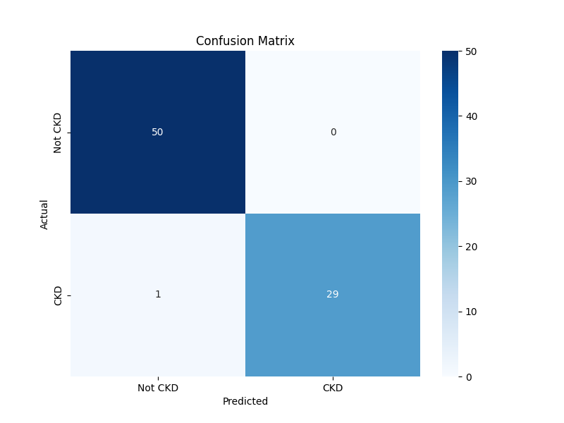
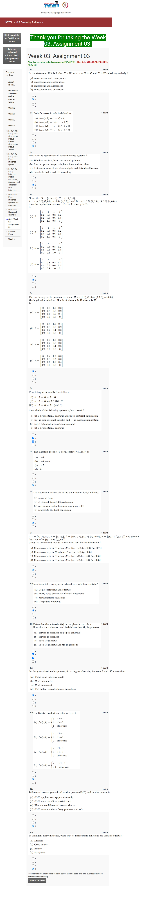
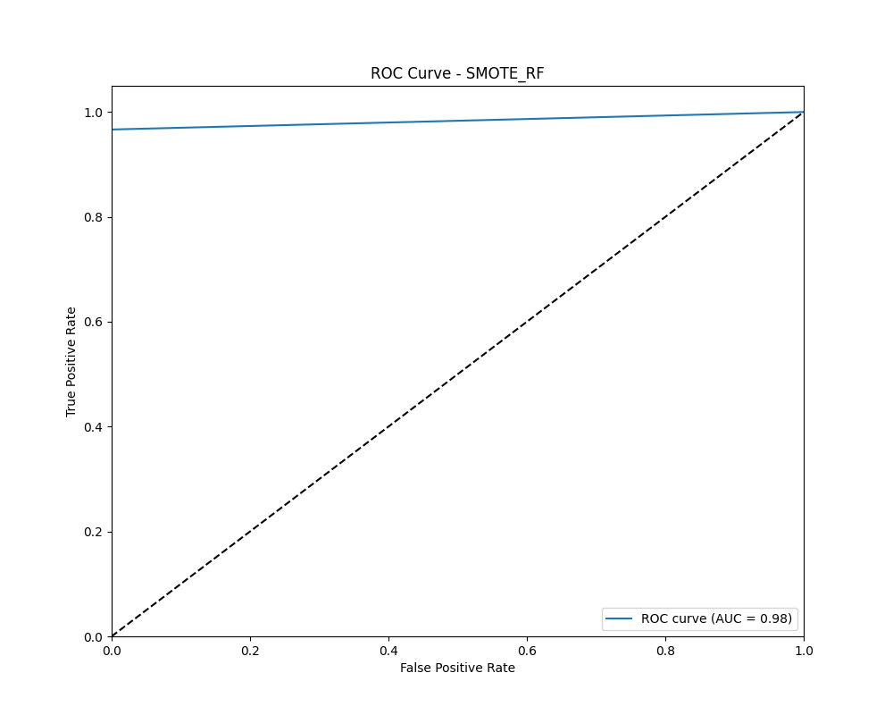

# Chronic Kidney Disease Prediction System



## Overview

This project implements a machine learning-based system for early detection and prediction of Chronic Kidney Disease (CKD) using clinical data. The system includes a comprehensive data processing pipeline, multiple machine learning models with performance evaluation, and a user-friendly web interface for healthcare professionals to input patient data and receive predictions.

## Features

- **Advanced Data Processing**: Handles missing values, outliers, and imbalanced data using techniques like SMOTE
- **Multiple ML Models**: Implements and compares various algorithms including Random Forest, Gradient Boosting, SVM, KNN, and XGBoost
- **Clinical Rule Integration**: Incorporates medical domain knowledge through clinical thresholds
- **Interactive Web Interface**: Streamlit-based application for easy data input and visualization
- **Medical Report Processing**: OCR capabilities to extract data from uploaded medical reports
- **Comprehensive Evaluation**: Performance metrics including accuracy, ROC AUC, F1 score, and confusion matrices
- **PDF Report Generation**: Creates downloadable clinical reports with prediction results

## Demo



## Installation

1. Clone the repository:
```bash
git clone https://github.com/yourusername/ckd-prediction-system.git
cd ckd-prediction-system
```

2. Install dependencies:
```bash
pip install -r requirements.txt
```

3. Set up Tesseract OCR (for medical report scanning):
   - Download and install [Tesseract OCR](https://github.com/tesseract-ocr/tesseract)
   - Update the path in `ckd_prediction_app.py` to match your installation:
   ```python
   pytesseract.pytesseract.tesseract_cmd = r'C:\Program Files\Tesseract-OCR\tesseract.exe'
   ```

## Usage

### Training the Model

To train the CKD prediction model:

```bash
python ckd_model_training.py
```

This will:
- Load and preprocess the kidney disease dataset
- Train the model with optimal hyperparameters
- Save the trained model to `ckd_model.joblib`
- Generate performance visualizations in the `plots` directory

### Running the Prediction App

To launch the web interface:

```bash
streamlit run ckd_prediction_app.py
```

The application provides two input methods:
1. **Manual Input**: Enter patient details and test values directly
2. **Image Upload**: Upload medical reports for automatic data extraction

## Model Performance

The system implements multiple models with different sampling techniques:
- Original dataset
- SMOTE (Synthetic Minority Over-sampling Technique)
- Random Under-sampling

Performance metrics for the best model:
- Accuracy: 97.5%
- ROC AUC: 0.989
- F1 Score: 0.976



## Dataset

The model is trained on the Chronic Kidney Disease dataset containing 400 patient records with 24 features including:
- Blood tests (hemoglobin, white blood cell count, etc.)
- Urine tests (specific gravity, albumin, etc.)
- Patient history (diabetes, hypertension, etc.)

## Project Structure

```
CKD_Project/
├── ckd_model_training.py    # Model training script
├── ckd_prediction_app.py    # Streamlit web application
├── models.py                # Model definitions
├── kidney_disease.csv       # Dataset
├── requirements.txt         # Dependencies
├── models/                  # Saved model files
├── plots/                   # Performance visualizations
└── metrics/                 # Evaluation metrics
```

## Future Improvements

- Integration with electronic health record (EHR) systems
- Mobile application for remote monitoring
- Additional biomarkers and feature engineering
- Explainable AI components for clinical decision support
- Longitudinal analysis for disease progression prediction

## License

This project is licensed under the MIT License - see the LICENSE file for details.

## Acknowledgments

- Dataset provided by UCI Machine Learning Repository
- Special thanks to healthcare professionals who provided domain expertise
- Streamlit for the interactive web framework